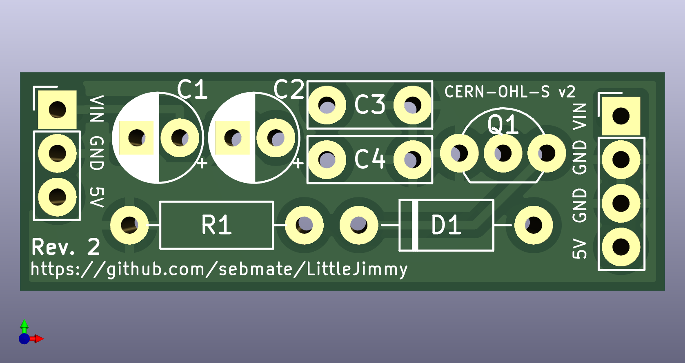

# LittleJimmy Crowbar Protection Circuit

## Introduction

LittleJimmy is a small crowbar circuit for Arduino-like development boards aiming to protect against a failing AMS1117 5.0V linear voltage regulator when the board is powered over VIN. 

Typically, these development boards use an "AMS1117" 5V voltage regulator of questionable quality (see [this](https://goughlui.com/2021/03/27/note-linear-regulator-woes-when-is-an-ams1117-not-an-ams1117) interesting blog post). This regulator may fail with a full or partial internal short and pass the input voltage (VIN) to the rest of the circuit. This may kill the microcontroller and all other components connected to the 5V rail.

Please note that real Arduino boards use high-quality linear voltage regulators. For these, there is no need to use the circuit presented here -- another good reason to buy the real Arduinos! The circuit is also not needed if the development board is powered via USB.

(In case you're wondering: The name "LittleJimmy" comes from the fact that in Britain and Australia a crowbar is also called a "jimmy". :smiley: )

## Licensing

The information and files in this repository are provided under the [CERN-OHL-S v2](cern_ohl_s_v2.txt) open source license (please click [here](https://ohwr.org/project/cernohl/wikis/Documents/CERN-OHL-version-2) for details).

## Implementation

The LittleJimmy board implements a "crowbar circuit" (see [this](https://circuitdigest.com/electronic-circuits/crowbar-circuit-diagram) link for an excellent description). In case the linear regulator fails, a Zener diode trips the thyristor and creates a full short on the 5V rail (hence the name "crowbar"), which then blows a fuse that protects the development board.

The LittleJimmy board has two connectors, one with 3 pins and one with 4 pins. The 3-pin connector can be used for the "MEGA 2560 PRO" board, the 4-pin connector with "Uno" or "Mega 2560" compatible development boards.

The board can accommodate two optional tantalum capacitors (C1 and C2) in case the "AMS1117" is to be replaced with another "1117"-type regulator from a renowned manufacturer (e.g. LM1117 by Texas Instruments or TS1117 by Taiwan Semiconductor), purchased from a reputable electronics distributor.

When using a 5.1 V Zener diode, the circuit should trip at about 5.5V, according to my tests. Note that not all 5.1 V Zener diodes behave the same. The "BZX 85C5V1", for example, trips the circuit at 4.5 V. This may need some experimentation. I therefore suggest to mount the diode in a way it can be easily replaced. Unfortunately I do not have a model number for the one I'm currently using. I hope to be able to provide details in the near future. Feedback is welcome!

**Important:** Note that it is necessary to protect VIN of the development board with a fuse. Its value must be high enough to not blow during normal operation, but lower than the allowed current of the thyristor (0.8A). Depending on the application, a 0.1A fuse might be a good choice.

## Testing the Circuit

To test the crowbar circuit, connect it to a laboratory power supply set to 3 V with a current limit of 50 mA. The circuit should draw (almost) no current and the power supply should be in constant voltage (CV) mode. Increase the voltage slowly. When it exceeds the Zener diode voltage, the thyristor should trip and produce a short circuit, and the power supply should go into constant current (CC) mode. Note that the circuit may not trip exactly at the Zener diode voltage (see above).

## Parts Lists

A list for the German electronics distributor Reichelt can be accessed directly via this link: [https://www.reichelt.de/my/2052760](https://www.reichelt.de/my/2052760). This list may contain alternative parts that are not essential. The list should therefore not be ordered blindly. Please note that I am not affiliated with Reichelt and am only providing this list for your convenience. The parts may be available from other vendors at a lower price.
